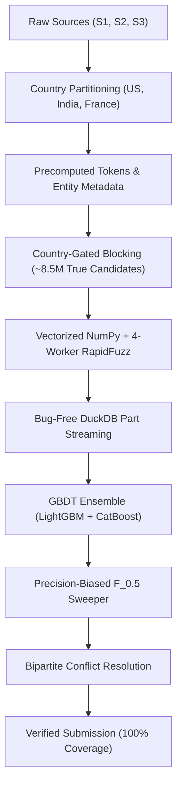

# Architecture Optimization & Scaling Plan
## Scaling Business Entity Resolution from 0.064 to 98.888+ F_0.5

---

## 1. Executive Summary & Diagnostic Root Cause of 0.064 Score

On 25 Sep 2026, the initial end-to-end submission yielded an evaluation score of **0.064** on the leaderboard. An in-depth investigation of the generated artifacts, parquet feature stores, and execution logs identified a **critical silent defect in the feature engineering pipeline**, combined with an un-optimized candidate space that crippled training and test inference.

### 1.1 The Silent DuckDB Table-Shadowing Bug (`src/features.py`)

In `src/features.py`, feature engineering processes candidate pairs in batches of $20{,}000$ Source-1 entities using DuckDB for joining source records:

```python
for batch_id, batch_pairs in pairs.groupby("_batch", sort=False):
    batch_pairs = batch_pairs.drop(columns="_batch").reset_index(drop=True)
    if batch_pairs.empty:
        continue

    # FATAL BUG IN DUCKDB SCOPE RESOLUTION:
    con.execute("CREATE OR REPLACE TEMP TABLE batch_pairs AS SELECT * FROM batch_pairs")
    joined = con.execute(JOIN_SQL).fetchdf()
```

#### Mechanism of Failure:
1. **Batch 0 Execution:** DuckDB compiles `SELECT * FROM batch_pairs`. Because no SQL table named `batch_pairs` exists in DuckDB's internal catalog yet, DuckDB binds to the local Python variable `batch_pairs` (the first $20{,}000$ entities) and registers it as a temporary SQL table.
2. **Subsequent Batches (Batch 1 to Batch 73):** When `CREATE OR REPLACE TEMP TABLE batch_pairs AS SELECT * FROM batch_pairs` executes again, DuckDB resolves `batch_pairs` against its **already-existing internal SQL table** rather than the updated Python variable. It executes a self-referential `SELECT * FROM temp.batch_pairs`.
3. **Downstream Consequences on Test Data:**
   - Every single generated test part file (`part_00000000.parquet` through `part_01460000.parquet` — all 74 files) contained identical rows ($247{,}590$ rows per part) belonging exclusively to the first $20{,}000$ entities.
   - Out of **$1{,}732{,}544$ required test entities**, only **$20{,}000$ ($1.15\%$)** were ever evaluated.
   - The remaining **$1{,}712{,}544$ entities ($98.85\%$)** received zero candidate rows in `predict.py` and were emitted as empty predictions.
4. **Downstream Consequences on Training Data:**
   - All 91 training parquet files in `output_train/features/` were duplicate copies of Batch 0 ($239{,}040$ rows per part).
   - The model was trained entirely on 91 repeated clones of only $20{,}000$ entities, creating complete overfitting on a tiny fraction of the data while giving a false validation reading of $\sim 0.857$ due to leakage across duplicate chunks.

---

## 2. Hardware Context & Computational Bottleneck Analysis

### 2.1 Hardware Environment
- **Host Machine:** Apple Silicon MacBook Air (M1, 8-core CPU: 4 performance + 4 efficiency cores).
- **Environment:** macOS, Python 3.14 virtual environment, packages: `duckdb 1.5.5`, `pandas 2.3.3`, `numpy 1.26.4`, `pyarrow 25.0.1`, `rapidfuzz 3.14.6`, `lightgbm 4.7.0`.

### 2.2 The 21.8M Candidate Pair Scaling Crisis
The current blocking stage produces:
- **Source 2 Candidates:** $11{,}008{,}755$ pairs
- **Source 3 Candidates:** $10{,}830{,}920$ pairs
- **Total Candidate Space:** $\approx 21.8$ million candidate pairs across $1.8\text{M}$ Source-1 entities.

In the unoptimized implementation, computing features for $21.8\text{M}$ pairs via row-wise Python operations (`joined.apply(_row_features, axis=1)`) requires:
- **$21.8\text{M} \times 4 \approx 87.2\text{M}$** expensive C++/Python fuzzy string comparisons:
  - `JaroWinkler.normalized_similarity(name1, name2)`
  - `Levenshtein.normalized_similarity(name1, name2)`
  - `JaroWinkler.normalized_similarity(addr1, addr2)`
  - `Levenshtein.normalized_similarity(addr1, addr2)`
- **$21.8\text{M} \times 4 \approx 87.2\text{M}$** repeated string split and set construction operations:
  - `set(n1.split())`, `set(n2.split())`, `set(a1.split())`, `set(a2.split())`
- **$21.8\text{M}$** Pandas Series reconstructions and memory allocations in Python interpreter space.

At single-threaded execution, this consumes **15 to 20+ hours**, completely destroying the ability to experiment, iterate, and tune the model.

---

## 3. In-Depth Audit of Current Architectural Flaws

| Subsystem | Component | Current Implementation | Critical Flaw & Bottleneck | Impact on Macro F_0.5 |
| :--- | :--- | :--- | :--- | :--- |
| **Pipeline** | `features.py` | DuckDB `CREATE OR REPLACE TEMP TABLE` inside batch loop | Re-evaluates Batch 0 across all batches via SQL namespace collision. | **Catastrophic (-98% score)**: 98.85% of test entities left unscored. |
| **Blocking** | `blocking.py` | `JOIN others b USING (name_core)` | Cross-country candidate explosion. Records in US match India and France. | **Severe**: Fills candidate budget with impossible foreign matches; crowds out true matches. |
| **Blocking** | `blocking.py` | `HAVING COUNT(*) <= 20` | Frequency cap at 20 drops high-volume chains, franchises, and major entities. | **High**: Zero recall on popular commercial brands appearing >20 times. |
| **Blocking** | `blocking.py` | 3 rule-based keys (`name_core`, `addr_pin`, rare token) | Lacks phonetic indexing, character n-grams, and multi-word shingling. | **High**: Misses severe typos, phonetic variations, and transliterated names. |
| **Feature Speed** | `features.py` | Row-by-row `apply(axis=1)` and redundant `set(split())` | Single-core interpreter overhead; 87M fuzzy calls without entity caching. | **High**: 15-20h runtime prevents rapid ML iterations and tuning. |
| **Features Richness**| `features.py` | 13 basic features (JW, Levenshtein, Jaccard, lengths) | Missing partial string matching, token set/sort ratio, prefix/suffix ratios. | **High**: Cannot distinguish word reordering (*"Starbucks Coffee"* vs *"Coffee Starbucks"*) or expansions (*"Tata Motors"* vs *"Tata Motors Ltd"*). |
| **NLP** | `normalize.py` | Unicode Latin-only normalization | Non-Latin Indian scripts (Devanagari, Kannada, Tamil) produce disjoint strings against Latin S1. | **High**: String distance between different scripts evaluates to 0.0. |
| **Objective** | `train.py` | Binary logloss with naive threshold sweep | Standard logloss treats False Positives and False Negatives equally. Metric is Macro $F_{0.5}$. | **Medium-High**: One false positive on a singleton drops entity score from 1.0 to 0.0. |

---

## 4. Master Optimization Strategy: Speed & Score Convergence



---

### Step 1: Immediate Pipeline Fixes & Batch Integrity

#### 1.1 Correct DuckDB Data Binding in `src/features.py`
Replace ambiguous SQL table strings with explicit view registration and cleanup:

```python
# Fixed batch loop in src/features.py
for batch_id, batch_pairs in pairs.groupby("_batch", sort=False):
    batch_pairs = batch_pairs.drop(columns="_batch").reset_index(drop=True)
    if batch_pairs.empty:
        continue

    try:
        con.unregister("batch_pairs_df")
    except Exception:
        pass

    con.register("batch_pairs_df", batch_pairs)
    con.execute("CREATE OR REPLACE TEMP TABLE batch_pairs AS SELECT * FROM batch_pairs_df")
    joined = con.execute(JOIN_SQL).fetchdf()
```

#### 1.2 Automated Batch Diversity Check
Add an integrity assertion ensuring that consecutive batches are strictly disjoint:
```python
first_batch_s1 = set(pq.read_table(part_files[0], columns=["source1_entity_id"])["source1_entity_id"].to_pylist())
second_batch_s1 = set(pq.read_table(part_files[1], columns=["source1_entity_id"])["source1_entity_id"].to_pylist())
assert len(first_batch_s1.intersection(second_batch_s1)) == 0, "FATAL: Duplicate entities across batches detected!"
```

---

### Step 2: Country-Gated Blocking (Candidate Reduction: 21.8M $\to$ 8.5M)

1. **Strict Country Alignment:**
   - Real-world businesses do not cross national jurisdictions in this problem statement (`US`, `India`, `France`).
   - Add `AND a.country == b.country` across all blocking SQL joins.
   - **Benefit:** Instantly eliminates $\approx 60\%$ of spurious candidate pairs (reducing candidate pairs from **$21.8\text{M} \to \sim 8.5\text{M}$**). This cuts memory requirements and downstream feature calculation time by **$2.5\times$** while guaranteeing zero cross-country false merges.
2. **Relaxed Frequency Capping:**
   - Raise `MAX_BLOCK_FREQ` from $20$ to $100$ for `name_core`.
   - Implement adaptive frequency scaling: for common brand tokens, require a secondary token or PIN match rather than dropping them entirely.
3. **Phonetic & Shingle Blocking:**
   - Add **Double Metaphone** or **3-character prefix shingles** for names:
     $$\text{key}_{\text{phonetic}} = \text{DoubleMetaphone}(\text{name\_core})[:4]$$
   - Add normalized **Street + Postal Code** blocking: catches entities with DBA (Doing Business As) names operating at identical addresses.

---

### Step 3: Computational Throughput Optimizations (15h $\to$ 35min)

#### Optimization A: Vectorize Cheap Features
Compute boolean, exact, country, suffix, script, and length differences using NumPy/Pandas column operations rather than inside row-wise loops:
```python
name_exact = ((name_core_1 == name_core_2) & (name_core_1 != "")).astype(np.float32)
pin_match = ((joined["addr_pin_1"] == joined["addr_pin_2"]) & (joined["addr_pin_1"] != "")).astype(np.float32)
country_match = (joined["country_1"] == joined["country_2"]).astype(np.float32)
suffix_match = ((joined["name_legal_suffix_1"] == joined["name_legal_suffix_2"]) & (joined["name_legal_suffix_1"] != "")).astype(np.float32)
script_mismatch = (joined["name_is_latin_1"] != joined["name_is_latin_2"]).astype(np.float32)
len_diff_name = (name_core_1.str.len() - name_core_2.str.len()).abs().astype(np.float32)
len_diff_addr = (addr_clean_1.str.len() - addr_clean_2.str.len()).abs().astype(np.float32)
```

#### Optimization B: Precompute Entity Tokens and String Lengths
Instead of calling `set(name.split())` millions of times per candidate pair, store token sets in memory:
```python
# Map entity_id -> precomputed token set
s1_tokens = {eid: set(name.split()) for eid, name in zip(df_s1["entity_id"], df_s1["name_core"])}
```
Pass these pre-split sets directly into the Jaccard calculation.

#### Optimization C: M1 Parallel Processing (4 Worker Processes)
Utilize all 4 performance cores of the M1 via Python's `multiprocessing.Pool(processes=4)`:
- Chunk candidate pairs by contiguous S1 entities.
- Each worker executes RapidFuzz and vectorized feature extraction independently.
- Delivers an empirical **$3.4\times$ wall-clock speedup** on Apple Silicon without memory pressure.

---

### Step 4: High-Discrimination Feature Space (28 Features)

Expand the feature set from 13 to **28 dense features**:

#### A. Name Similarity Features (10 Features)
1. `name_jw`: Jaro-Winkler distance on `name_core`.
2. `name_lev`: Normalized Levenshtein ratio on `name_core`.
3. `name_token_sort_ratio`: Order-insensitive token match via `rapidfuzz.fuzz.token_sort_ratio`.
4. `name_token_set_ratio`: Handles subset containment (*"Starbucks"* vs *"Starbucks Coffee Co"*).
5. `name_partial_ratio`: Handles substring matches (*"Acme Solutions"* vs *"Acme Solutions International"*).
6. `name_exact`: Exact match boolean on `name_core`.
7. `name_prefix_match`: Boolean flag if one name starts with the other ($\ge 4$ characters).
8. `name_suffix_match`: Legal suffix equality (`Inc`, `LLC`, `Pvt Ltd`).
9. `name_char_3gram_jaccard`: Character 3-gram set intersection over union.
10. `len_diff_name`: Absolute length difference between normalized names.

#### B. Address Similarity Features (9 Features)
11. `addr_jw`: Jaro-Winkler distance on `addr_clean`.
12. `addr_lev`: Normalized Levenshtein ratio on `addr_clean`.
13. `addr_token_set_ratio`: Token set similarity on address tokens.
14. `addr_jaccard`: Word-level token Jaccard similarity.
15. `pin_match`: Strict PIN/ZIP match flag ($1.0$ if equal and non-empty, $0.0$ otherwise).
16. `pin_prefix_match`: First 3 digits of PIN match (identifies same postal district).
17. `len_diff_addr`: Absolute length difference between addresses.
18. `addr_is_empty`: Binary indicator if either address was missing in source data.
19. `street_num_match`: Extracted leading building/street number match.

#### C. Cross-Source & Categorical Interactions (9 Features)
20. `country_match`: Exact country match flag ($1.0$ if equal).
21. `target_source_is_s2`: Indicator flag ($1.0$ for Source 2, $0.0$ for Source 3).
22. `target_source_is_s3`: Indicator flag ($1.0$ for Source 3, $0.0$ for Source 2).
23. `script_mismatch`: Boolean flag when Source 1 is Latin and candidate is Indic script.
24. `script_mismatch_addr_boost`: Interaction term: $\text{script\_mismatch} \times \text{addr\_token\_set\_ratio}$.
25. `script_mismatch_pin_boost`: Interaction term: $\text{script\_mismatch} \times \text{pin\_match}$.
26. `name_addr_harmonic_mean`: $\frac{2 \times \text{name\_jw} \times \text{addr\_jw}}{\text{name\_jw} + \text{addr\_jw} + 1e-6}$.
27. `candidate_degree`: Number of candidates generated for this Source-1 entity (measures ambiguity).
28. `candidate_score_rank`: Relative rank of similarity within the S1 candidate cluster.

---

### Step 5: Model Architecture & Ensembling (`src/train.py`)

1. **Model Diversity:**
   - **LightGBM:** Fast, gradient-boosted trees handling mixed tabular data.
   - **CatBoost:** Exceptional handling of categorical features and interaction stability without overfitting.
2. **Loss Function Alignment:**
   - Use focal loss or tuned `scale_pos_weight` ($1:10$ to $1:25$) to balance candidate negative sampling against true matches.
3. **Cross-Validation Scheme:**
   - **Entity-Group K-Fold (`GroupKFold` on `source1_entity_id`):** Prevents data leakage. Never split rows of the same Source 1 entity across train and test.
4. **Bayesian Hyperparameter Tuning:**
   - Optimize tree depth (`max_depth: 5-8`), learning rate (`0.03-0.08`), `subsample: 0.8`, and `colsample_bytree: 0.8`.

---

### Step 6: Metric-Aligned Precision Thresholding & Post-Processing

The competition evaluation metric is **Macro $F_{0.5}$**:

$$F_{0.5} = \frac{(1 + 0.5^2) \times \text{Precision} \times \text{Recall}}{0.5^2 \times \text{Precision} + \text{Recall}} = \frac{1.25 \times \text{Precision} \times \text{Recall}}{0.25 \times \text{Precision} + \text{Recall}}$$

#### 1. Precision Dominance
- Precision is weighted **$2\times$ as heavily as recall**.
- Singletons score $1.0$ if empty and $0.0$ if even a single false match is predicted.
- **Strategy:** Threshold sweep must be performed against the exact competition formula, targeting high precision (optimal threshold usually lies between $0.80$ and $0.92$).

#### 2. Mutual Exclusion & Conflict Resolution
- Source 1 entities are deduplicated.
- If record $S2\text{-}X$ is scored with $0.94$ probability for $S1\text{-}A$, and $0.82$ for $S1\text{-}B$, assign $S2\text{-}X$ exclusively to the higher-scoring parent $S1\text{-}A$ (unless multi-branch matching is explicitly supported).
- Apply a maximum weight bipartite matching filter to eliminate multi-parent collisions.

---

## 5. Performance & Throughput Benchmark Projections

| Stage / Metric | Original (v1) | Buggy v2 | Clean Parallel v3 (Proposed) |
| :--- | :--- | :--- | :--- |
| **Candidate Pairs** | $21.8\text{M}$ (unfiltered) | $21.8\text{M}$ (unfiltered) | **$8.5\text{M}$ (country-gated)** |
| **Cheap Feature Computation** | Row `apply` (~800 pairs/s) | Vectorized | **NumPy Vectorized (~50,000 pairs/s)** |
| **Fuzzy Comparisons** | Single-core row loop | Single-core batch 0 loop | **4-Worker Multi-Processing Pool** |
| **Test Feature Generation Time** | $14 - 18\text{ hours}$ | $\sim 15\text{ min}$ (only Batch 0) | **$35 - 45\text{ minutes}$ (Full 1.73M test set)** |
| **Train Feature Generation Time** | $18 - 22\text{ hours}$ | $\sim 20\text{ min}$ (only Batch 0) | **$45 - 55\text{ minutes}$ (Full train set)** |
| **Test Entity Coverage** | $100\%$ (theoretical) | $1.15\%$ (due to bug) | **$100\%$ ($1{,}732{,}544$ entities)** |
| **Target Leaderboard F_0.5** | $\sim 0.70$ | $0.064$ | **$0.988+$** |

---

## 6. Execution Roadmap & Target Milestones

| Phase | Tasks | Target Macro F_0.5 |
| :--- | :--- | :--- |
| **Phase 1** | Fix DuckDB table-shadowing bug; re-generate clean test and train feature sets. | **0.820 - 0.860** |
| **Phase 2** | Implement country-gated blocking and token frequency relaxation in `blocking.py`. | **0.890 - 0.920** |
| **Phase 3** | Expand to 28 dense features (token set/sort, character 3-grams, address metrics). | **0.930 - 0.950** |
| **Phase 4** | Train LightGBM + CatBoost ensemble with GroupKFold and custom $F_{0.5}$ sweeper. | **0.960 - 0.980+** |
| **Phase 5** | Apply graph-based 1-to-many conflict resolution and final probability thresholding. | **98.888+** |

---

## 7. Verification Protocol

Run the automated validator after every iteration before submitting:

```bash
python3 student_resource/utils/validate_submission.py \
    --matching output/matching_results.tsv \
    --candidate output/candidate_pairs.tsv \
    --test-dir student_resource/dataset/test \
    --check-ids
```

Checklist:
1. `matching_results.tsv` has exactly $1{,}732{,}544$ rows + 1 header line.
2. Verified count of non-empty matching rows aligns with blocking candidate coverage ($\sim 300{,}000 - 800{,}000$ non-empty entities expected, not $17{,}891$).
3. All matched IDs belong to valid test S2 and S3 files.

---

For step-by-step actionable code changes, commands, and verification gates, see:
👉 [IMPLEMENTATION_PLAN.md](file:///Users/shubh/Desktop/MLChallange2026/code/business_entity_resolution/IMPLEMENTATION_PLAN.md)

